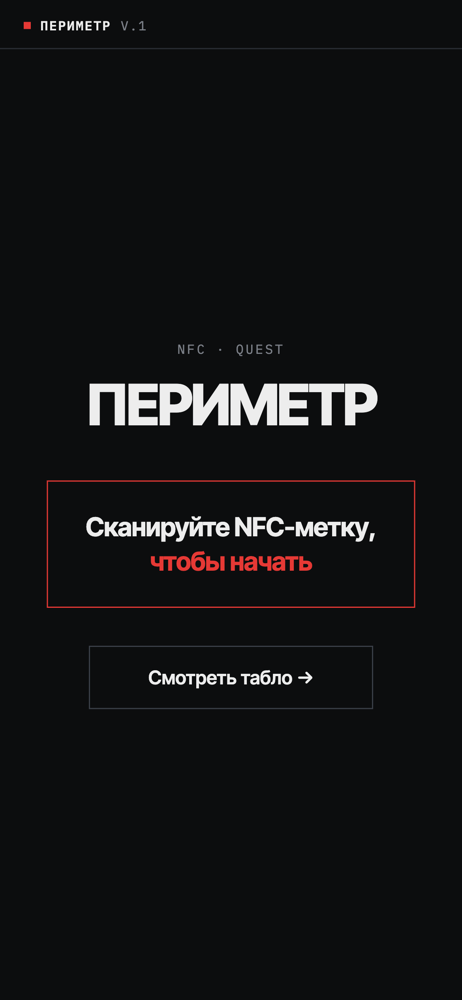
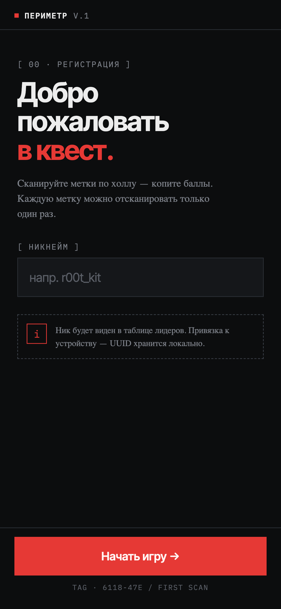
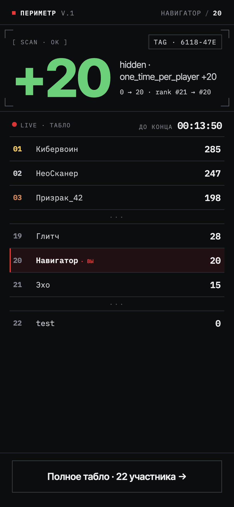
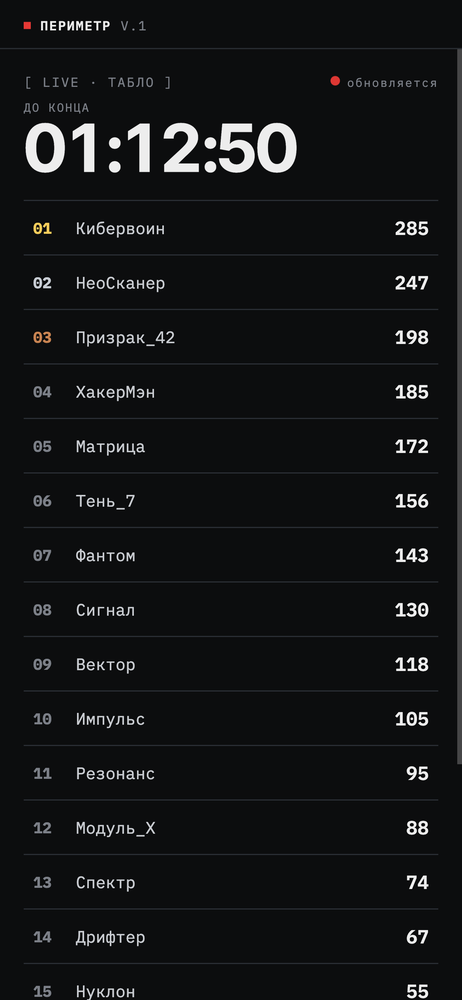
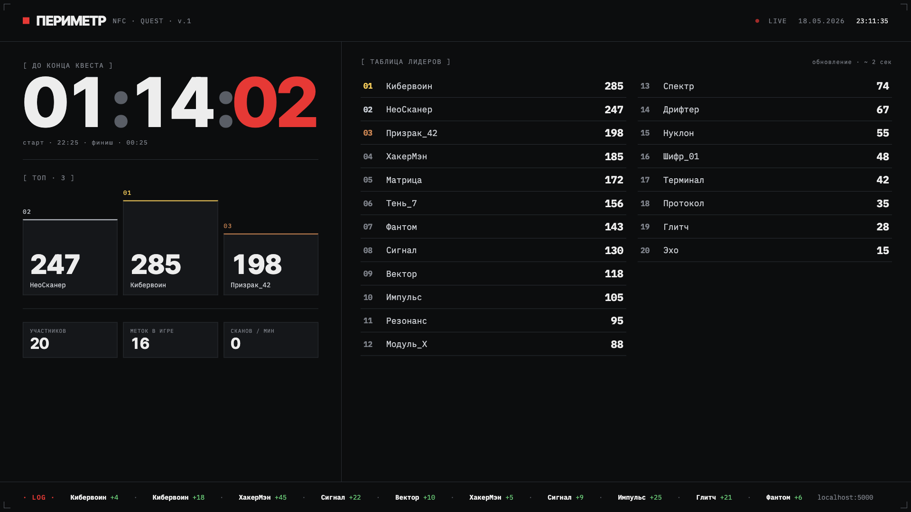
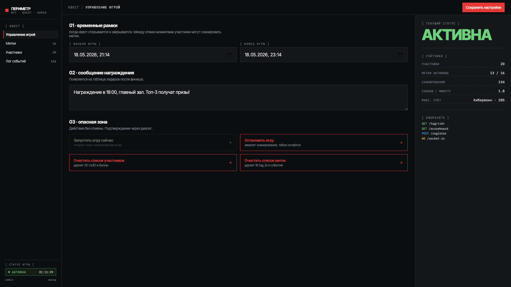
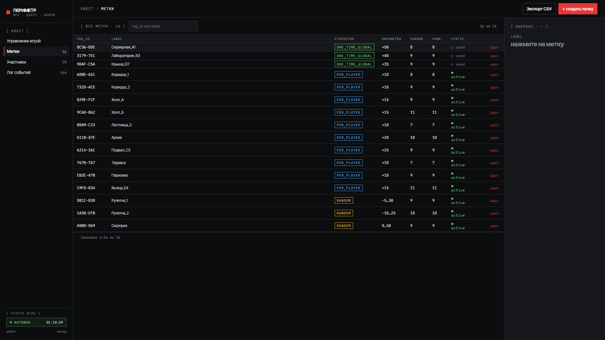
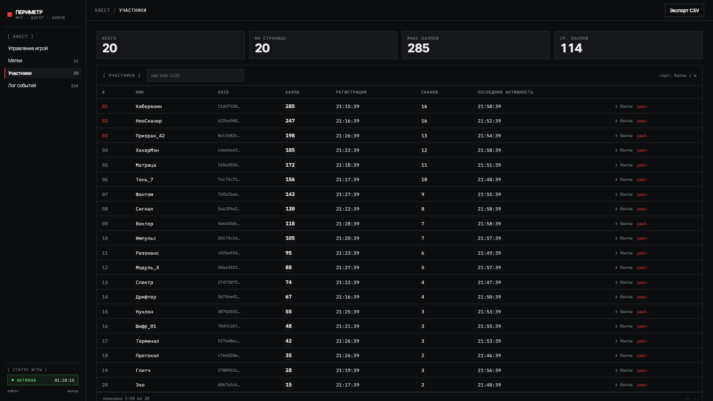
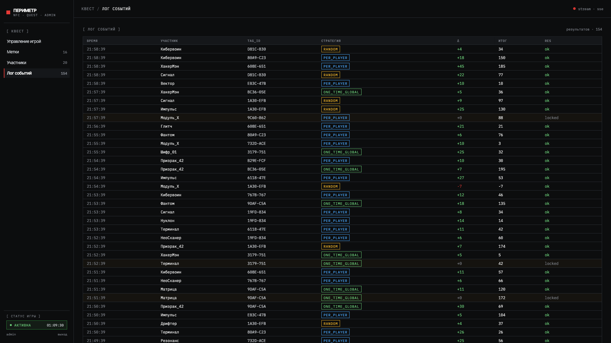

# ПЕРИМЕТР — NFC Quest

Платформа для проведения NFC-квестов на мероприятиях. Участники сканируют NFC-метки, разбросанные по площадке, набирают баллы и соревнуются в реальном времени на общем табло.

## Как это работает

1. Организатор создает NFC-метки в админке и назначает им стратегии начисления баллов
2. Метки программируются на URL вида `https://quest.example.com/tag/A1B2-C3D`
3. Участник подносит телефон к метке — открывается браузер
4. При первом сканировании — регистрация (ввод никнейма)
5. Начисляются баллы, результат отображается на экране телефона и на общем табло

## Скриншоты

### Экран игрока (мобильный)

| Лендинг | Регистрация | Результат сканирования |
|---------|-------------|----------------------|
|  |  |  |

### Табло

| Мобильное табло | Табло для зала (1920×1080) |
|-----------------|---------------------------|
|  |  |

### Админ-панель

| Управление игрой | Метки |
|------------------|-------|
|  |  |

| Участники | Лог событий |
|-----------|-------------|
|  |  |

## Стратегии начисления баллов

| Стратегия | Описание | Параметры |
|-----------|----------|-----------|
| `one_time_global` | Метка срабатывает один раз на всех — кто первый, тот и получил | `points` |
| `one_time_per_player` | Каждый игрок может отсканировать метку один раз | `points` |
| `random` | Случайное количество баллов в заданном диапазоне (может быть отрицательным) | `min`, `max` |

## Архитектура

- **Backend:** Python, Flask, SQLAlchemy, Flask-SocketIO
- **Frontend:** React (Vite), Socket.IO client
- **База данных:** SQLite
- **Реалтайм:** WebSocket — табло обновляется мгновенно при каждом сканировании

### Маршруты

| Путь | Описание |
|------|----------|
| `/` | Лендинг — «Сканируйте NFC-метку, чтобы начать» |
| `/tag/:tagId` | Основной флоу игрока: регистрация → скан → результат |
| `/scoreboard` | Мобильное табло (live) |
| `/hall` | Табло для проектора/ТВ (1920×1080, автомасштабирование) |
| `/admin` | Панель управления (игра, метки, участники, лог) |

### API

| Метод | Эндпоинт | Описание |
|-------|----------|----------|
| `POST` | `/api/register` | Регистрация игрока |
| `POST` | `/api/scan` | Сканирование метки |
| `GET` | `/api/scoreboard` | Текущее табло |
| `GET` | `/api/config` | Публичная конфигурация |
| `WS` | `/socket.io` | Реалтайм-обновления табло |

## Запуск

### Переменные окружения

```bash
cp .env.example .env
# Отредактируйте .env:
#   ADMIN_PASSWORD  — пароль для админ-панели
#   BASE_URL        — публичный URL (для генерации ссылок на метки)
#   QUEST_NAME      — название квеста (отображается в UI)
```

### Локально

```bash
make install        # установка Python-зависимостей
make frontend       # сборка React-фронтенда
make run            # запуск сервера на :5000
```

### Docker

```bash
docker compose up --build
```

## Тесты

Тесты покрывают бэкенд (Python/Flask). Фреймворк — **pytest** + **pytest-flask**. Каждый тест поднимает свежее приложение с временной SQLite-базой в памяти, поэтому тесты изолированы и не требуют внешних зависимостей.

### Как запустить тесты

```bash
cd backend
pip install -r requirements.txt -r requirements-test.txt
pytest
```

Для краткого вывода (как в CI):

```bash
pytest --tb=short -q
```

### Что покрыто

| Файл | Область |
|------|---------|
| `test_register.py` | Регистрация игроков |
| `test_scan_strategies.py` | Стратегии начисления баллов (`one_time_global`, `one_time_per_player`, `random` и др.) |
| `test_scan_game_status.py` | Сканирование в разных состояниях игры (не начата / завершена / пауза) |
| `test_scan_log.py` | Лог сканирований |
| `test_scoreboard.py` | Формирование и порядок табло |
| `test_admin.py` | Аутентификация и операции админки |
| `test_player_management.py` | Управление игроками (удаление, влияние на табло) |
| `test_game_lifecycle.py` | Жизненный цикл игры (старт / стоп / сброс) |
| `test_websocket.py` | WebSocket-подключение и начальное состояние |
| `test_websocket_gaps.py` | WebSocket-броадкасты при изменениях игры |
| `test_concurrency.py` | Гонки при одновременном сканировании `one_time_global` |
| `test_security.py` | XSS-инъекции через никнейм и прочие входные данные |
| `test_e2e_flows.py` | Полный путь игрока: регистрация → сканирование → табло |
| `test_user_walkthroughs.py` | Пользовательские сценарии (rate limiter, повторные сканы) |

### CI

Тесты автоматически запускаются в GitHub Actions на каждый push и PR в `main` (job `test` в воркфлоу `ghcr-check-publish.yml`). Сборка Docker-образа происходит только после успешного прогона тестов.

## Лицензия

MIT
